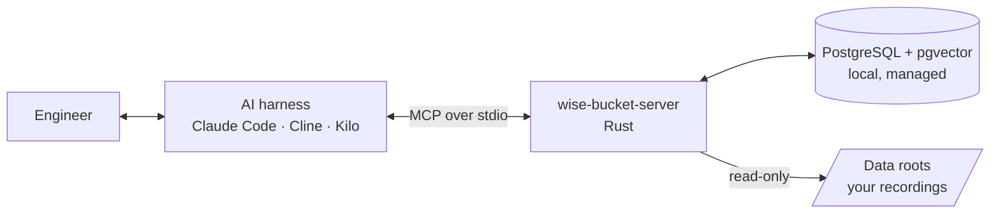

<div align="center">

# 🪣 Wise Bucket

**Evidence-backed, iterative robot investigations for your AI coding agent.**

[](https://github.com/MBagory/wise-bucket/actions/workflows/ci.yml)
[](https://mbagory.github.io/wise-bucket/)
[](LICENSE)
[](Cargo.toml)


</div>

Wise Bucket is a local [MCP](https://modelcontextprotocol.io) server that gives your AI harness (Claude Code, Cline, Kilo Code, …) a **memory of your robot world** and a **measuring instrument for your recordings**. You keep asking questions in your usual tool; Wise Bucket keeps the answers grounded in your ROS bags, flight logs and CAN captures, and remembered across conversations.

- **Start with a question:** *"Why does the lidar drop scans when the arm moves fast?"* Wise Bucket knows (or asks) what "the lidar" is, helps structure testable hypotheses, and tells you exactly what to record next.
- **Start with data:** add new recordings; Wise Bucket analyzes them, flags anomalies and links them to your open questions. *(planned)*

> **Status: alpha, milestone M0 (foundation).** Installation, local database, data roots and the harness connection work today. See the [roadmap](#roadmap).

<!-- Demo: an asciinema cast of `setup` → `init` → Claude Code calling `server_info` will be embedded here. -->

## Table of contents

- [Features](#features)
- [Quick start](#quick-start)
- [How it works](#how-it-works)
- [Supported platforms and formats](#supported-platforms-and-formats)
- [Configuration](#configuration)
- [Documentation](#documentation)
- [Roadmap](#roadmap)
- [Contributing](#contributing)
- [Security and privacy](#security-and-privacy)
- [License](#license)
- [Acknowledgments](#acknowledgments)
- [How to cite](#how-to-cite)

## Features

| | Feature | Milestone |
| --- | --- | --- |
| ✅ | One binary, `setup` provisions a private **PostgreSQL 17 + pgvector** (checksum-verified) or uses yours | M0 |
| ✅ | **Data roots:** you declare the only folders Wise Bucket may read; the AI cannot add one | M0 |
| ✅ | `init` configures a robot repository for **Claude Code**, Kilo Code or Cline | M0 |
| ✅ | `doctor` checks everything; every error has a code and a documented fix | M0 |
| ✅ | Several harness windows at once; the database starts on demand and stops after the last session | M0 |
| 🗺️ | **Robot knowledge:** robots, sensors, buses; unknown things are asked about and remembered | M1 |
| 🗺️ | **Semantic + keyword search** (multilingual embeddings, computed locally) | M1–M4 |
| 🗺️ | **Investigations:** questions, hypotheses with testable predictions, recording recipes | M2 |
| 🗺️ | **ROS 2 MCAP** reader (native Rust), topics bound to your robot's components | M3 |
| 🗺️ | **Metrics with provenance**, interpretations, hypothesis checks, cross-round comparison | M4 |
| 🗺️ | PX4 ULog, CAN + DBC, ArduPilot, ROS 1, rosbag2 `.db3`, CSV | expansion |
| 🗺️ | Background analysis of new data, anomaly detection, notices | expansion |

## Quick start

Requirements: Linux or macOS (Windows through WSL2), a Rust toolchain until binaries are published, a C compiler for the one-time pgvector build (`xcode-select --install` or `build-essential`).

```sh
# 1. Install
git clone https://github.com/MBagory/wise-bucket && cd wise-bucket
cargo install --path crates/wb-server --locked

# 2. One-time machine setup: database + your recording folders
wise-bucket-server setup

# 3. In your robot repository
cd ~/code/rover
wise-bucket-server init --robot rover-b

# 4. Open Claude Code there, approve the `wise-bucket` server, then ask: "call server_info"
claude
```

Check your installation at any time:

```sh
wise-bucket-server doctor
```

## How it works



- **The LLM reasons; tools measure.** Wise Bucket never calls a model: your harness owns the model, your keys and your budget. Wise Bucket supplies memory, structure and measurements with provenance.
- **Local first.** Recordings stay where they are; the database runs on your machine, reachable only through a private Unix socket.
- **You set the boundaries.** Only declared data roots are readable, and there is no tool for the AI to add one.

More in [How it works](https://mbagory.github.io/wise-bucket/philosophy/how-it-works.html) and [Principles](https://mbagory.github.io/wise-bucket/philosophy/principles.html).

## Supported platforms and formats

| Platform | Status |
| --- | --- |
| Linux x86_64 / arm64 | ✅ |
| macOS Apple Silicon / Intel | ✅ |
| Windows | via WSL2 (native planned) |

| Recording format | Status |
| --- | --- |
| ROS 2 MCAP | M3 |
| rosbag2 `.db3`, CSV | expansion |
| PX4 ULog, CAN (candump/ASC/BLF + DBC), ArduPilot DataFlash, MAVLink tlog, ROS 1, MCAP protobuf/JSON | expansion |
| Betaflight blackbox, MDF4 | later |

## Configuration

| File | Purpose |
| --- | --- |
| `~/.config/wisebucket/config.toml` (Linux) · `~/Library/Application Support/wisebucket/config.toml` (macOS) | Your machine: database mode, **recording folders** |
| `<repo>/.wisebucket/config.toml` | The project: name, default robot (commit it) |
| `<repo>/.mcp.json` | How your harness starts Wise Bucket |

```sh
wise-bucket-server roots add bags ~/robot-logs/bags --robot rover-b
wise-bucket-server config show --origin
```

See [Configure](https://mbagory.github.io/wise-bucket/get-started/configure.html) and the [configuration reference](docs/src/reference/configuration.md).

## Documentation

- 📘 **Book:** <https://mbagory.github.io/wise-bucket/> (sources in [`docs/`](docs/src/SUMMARY.md))
- 🚀 [Install](docs/src/get-started/install.md) · [Configure](docs/src/get-started/configure.md) · [Connect your harness](docs/src/get-started/connect-your-harness.md)
- ❓ [FAQ](docs/src/faq.md) · 🛠️ [Troubleshooting](docs/src/troubleshooting.md) · 📑 [Error reference](docs/src/reference/errors.md) · ⌨️ [CLI reference](docs/src/reference/cli.md)

## Roadmap

Wise Bucket is built one milestone at a time; each is tested by real users before the next starts.

| # | Milestone | Value | Status |
| --- | --- | --- | --- |
| M0 | Foundation | Install, database, data roots, harness connection | ✅ |
| M1 | Knowledge + retrieval | The server remembers your robot world and finds it by alias, typo or paraphrase | next |
| M2 | Investigations | Structured, resumable questions and hypotheses; recording recipes | planned |
| M3 | Logs (ROS 2 MCAP) | Recordings become evidence linked to your robot | planned |
| M4 | Metrics, interpretations, search | Traceable numbers, comparable across rounds | planned |
| M5 | Evaluation gate | Real-case comparison before expanding | planned |

## Contributing

Contributions are welcome! Read [CONTRIBUTING.md](CONTRIBUTING.md) and our [Code of Conduct](CODE_OF_CONDUCT.md). Development in three commands:

```sh
cargo build
cargo test --workspace          # first run downloads PostgreSQL and builds pgvector (~1 min)
cargo run -p wb-server -- docs gen   # regenerate reference pages after changing the CLI or errors
```

## Security and privacy

- Recordings and the database stay on your machine; tool results your harness sends to its model follow the harness's terms.
- Downloads (PostgreSQL, pgvector sources) are verified against pinned SHA-256 checksums.
- Report vulnerabilities privately: see [SECURITY.md](SECURITY.md).

Details: [Trust and privacy](docs/src/philosophy/trust-and-privacy.md).

## License

Licensed under the [Apache License, Version 2.0](LICENSE). Unless you explicitly state otherwise, any contribution you intentionally submit for inclusion is licensed as above, without additional terms or conditions.

## Acknowledgments

Wise Bucket stands on the shoulders of [PostgreSQL](https://www.postgresql.org), [pgvector](https://github.com/pgvector/pgvector), the [PostgreSQL binaries by theseus-rs](https://github.com/theseus-rs/postgresql-binaries), the [Rust MCP SDK](https://github.com/modelcontextprotocol/rust-sdk), [SQLx](https://github.com/launchbadge/sqlx), [MCAP](https://mcap.dev) and the Rust and robotics open-source communities.

## How to cite

If Wise Bucket helps your research, please cite it using [CITATION.cff](CITATION.cff) (GitHub shows a *Cite this repository* button).
